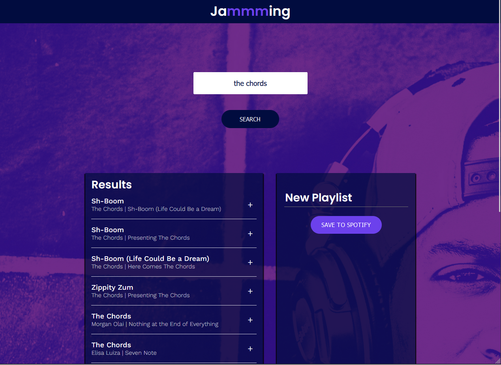

# The Eolian

Where pride pays silver and plays golden.
An app that lets you easily search songs and add them to your playlist, then save it to your Spotify account.

This was a project, Jammming, on Codecademy's React course.

## Live

Check out the web app live [here](https://jammming-sazed.netlify.app)

## Preview

### Install and run locally

Clone the repository

Install dependencies

    npm install

Run development server

    npm start
